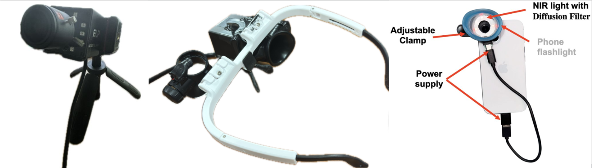

+++
title = "Image Test Page"
date = "2025-03-11"
draft = false
+++

## Testing Different Image Formats

### 1. Standard Markdown Image

### 2. Hugo Figure Shortcode



### 3. HTML Image Tag

### 4. Relative Path Image

### 5. Absolute URL Image

 